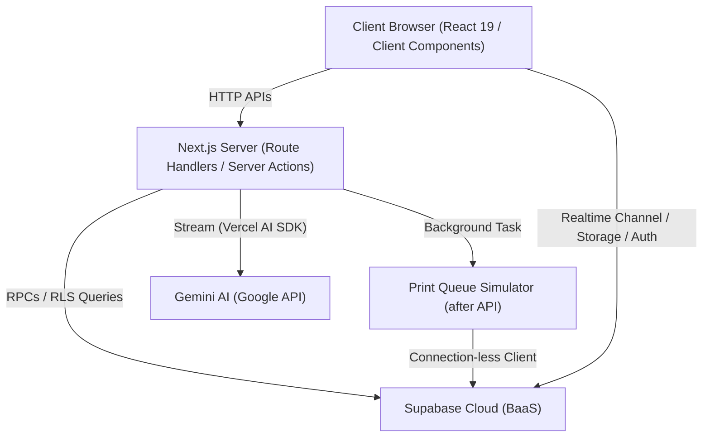
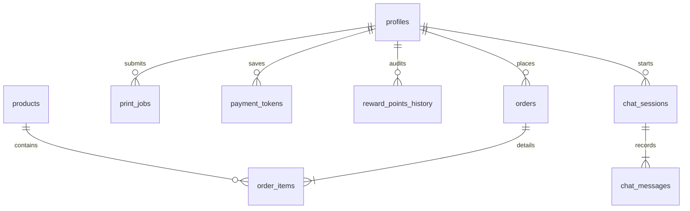
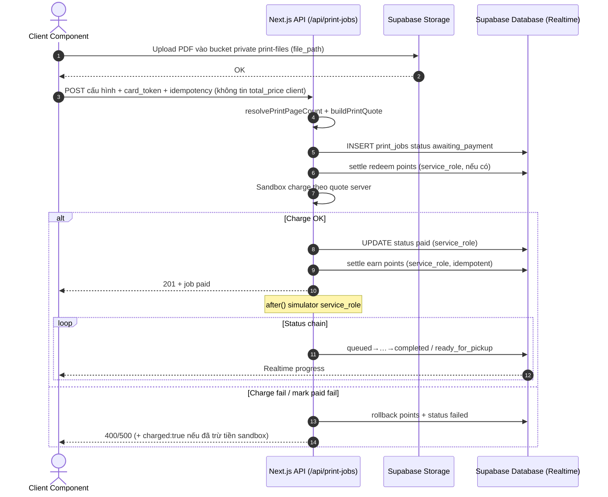

# Hướng Dẫn Kiến Trúc Hệ Thống PlatPrint (ARCHITECTURE.md)

Tài liệu này cung cấp hướng dẫn chi tiết về cấu trúc hệ thống, quy chuẩn thiết kế, mô hình cơ sở dữ liệu và các luồng nghiệp vụ lõi của dự án **PlatPrint** (Hệ thống in ấn từ xa & gian hàng trực tuyến).

---

## 1. Sơ Đồ Tổng Quan Kiến Trúc (Architecture Overview)

PlatPrint được xây dựng theo mô hình **Serverless Hybrid Architecture** kết hợp giữa Next.js 15+ (App Router), Supabase Cloud và Gemini AI.



Hệ thống phân chia trách nhiệm rõ ràng:

- **Client (Trực quan & Tương tác)**: Render UI, preview/đếm trang PDF client-side (chỉ UX), Local Cart, Realtime.
- **Next.js Server (Tầng Trung gian & AI)**: JWT Auth, sandbox tokenize/charge, **recompute giá / verify PDF pages**, gọi money RPC bằng **service_role**, streaming AI, Simulator `after()`.
- **Supabase Cloud (Cơ sở dữ liệu & Lưu trữ)**: RLS + RPC atomic; bucket `print-files` private + **owner-only SELECT**; money mutate RPC chỉ `service_role` (v6+).

---

## 2. Kiến Trúc Thư Mục Tính Năng (Feature-Based Architecture)

Dự án áp dụng triết lý thiết kế **Feature-based directory structure**. Các components con chỉ dùng riêng cho một tính năng cụ thể sẽ được cô lập hoàn toàn bên trong thư mục tính năng đó thay vì đặt ở thư mục dùng chung.

```text
NguyenDinhBao_Round2_Submission-/
├── app/                           # App Router
│   ├── auth/                      # Tính năng Xác thực (Auth)
│   │   ├── components/            # Cục bộ: AuthCard.tsx
│   │   └── page.tsx               # Trang Auth chính (< 350 dòng)
│   ├── chat/                      # Tính năng Trợ lý AI (Support Chat)
│   │   ├── components/            # Cục bộ: ChatBox.tsx
│   │   └── page.tsx               # Trang Chat chính (< 350 dòng)
│   ├── dashboard/                 # Bảng điều khiển (Dashboard)
│   │   ├── components/            # Cục bộ: DashboardOverview, DashboardPrintJobs, DashboardOrders
│   │   └── page.tsx               # Trang Dashboard chính (< 350 dòng)
│   ├── print/                     # Tính năng In ấn từ xa (Remote Print)
│   │   ├── components/            # Cục bộ: PrintPreview, PrintConfigForm, PrintProgressView
│   │   └── page.tsx               # Trang Print chính (< 350 dòng)
│   ├── store/                     # Gian hàng ấn phẩm (Store)
│   │   ├── components/            # Cục bộ: ProductCard, CartDrawer
│   │   └── page.tsx               # Trang Store chính (< 350 dòng)
│   ├── api/                       # RESTful Endpoints
│   │   ├── chat/route.ts          # API Gemini Streaming & DB log
│   │   ├── orders/route.ts        # API Đặt hàng & rollback
│   │   ├── print-jobs/route.ts    # API Tạo lệnh in & after() background task
│   │   ├── products/route.ts      # API Danh mục sản phẩm công khai
│   │   └── sandbox/payment/       # API Cổng Sandbox Tokenize & Charge
│   ├── globals.css                # Core Design System, OLED Black & Tailwind @theme
│   └── layout.tsx                 # Root layout & Metadata
├── components/                    # Global components dùng chung (Header.tsx)
├── lib/                           # Helpers & Supabase Clients
│   ├── supabase/
│   │   ├── client.ts              # Browser Client (createBrowserClient)
│   │   └── server.ts              # Server Client (createServerClient)
│   └── utils.ts                   # class merges cn() & calculatePrintCost()
├── types/                         # TypeScript definitions
│   ├── database.types.ts          # Định nghĩa kiểu DB tự sinh & SafeDatabase
│   └── pdfjs-dist.d.ts            # Type declarations cho PDFjs
└── supabase/                      # Database SQL
    ├── schema.sql                 # Schema đầy đủ: bảng, indices, RLS, procedures
    └── migrations/                # Migrations tăng dần v3 → v9
```

---

## 3. Thiết Kế Cơ Sở Dữ Liệu & RLS (Data Model & Security)

### A. Lược đồ dữ liệu (Database Schema)

Hệ thống sử dụng cơ sở dữ liệu quan hệ PostgreSQL với cấu trúc liên kết chặt chẽ:



### B. Row Level Security (RLS) & IDOR Defense

Tất cả các bảng chứa dữ liệu cá nhân của người dùng đều được bảo mật nghiêm ngặt bằng RLS:

- **Nguyên tắc**: User chỉ được phép đọc/ghi dữ liệu của chính mình thông qua điều kiện check `auth.uid() = user_id` (hoặc `id` / `owner`).
- **Profiles Protection**: Bảng `profiles` tuyệt đối **không cấp quyền UPDATE cho Client SDK**. Điểm thưởng (`reward_points`) chỉ được thay đổi trên server thông qua Stored Procedure chạy dưới quyền `SECURITY DEFINER` khi có hoá đơn thanh toán hợp lệ.
- **Storage Protection**: Bucket `print-files` **private**; DB lưu `file_path`; SELECT chỉ owner (`auth.uid() = owner`). Signed URL tạo on-demand khi cần đọc. Không có policy SELECT “authenticated trên cả bucket”.
- **Money RPC**: `mark_order_as_paid`, `rollback_failed_order`, `settle_print_job_points`, `rollback_print_job_points` — EXECUTE chỉ `service_role` + kiểm tra role trong body hàm.

---

## 4. Các Luồng Nghiệp Vụ Cốt Lõi (Core Workflows)

### A. Luồng Đặt hàng & Xử lý đồng thời (Store Checkout Loop)

```mermaid
sequenceDiagram
    autonumber
    actor User as Client Component
    participant Server as Next.js API (/api/orders)
    participant DB as Supabase PostgreSQL
    participant Card as Sandbox Gateway (/api/sandbox/payment)

    User->>Server: Gửi giỏ hàng, thông tin thẻ & Idempotency Key
    Server->>Card: Gửi thông tin thẻ yêu cầu Tokenize
    Card-->>Server: Trả về Secure Card Token (tok_last4_xxxx)
    Server->>DB: Gọi RPC create_order_with_stock_check (Pessimistic Lock)
    Note over DB: 1. Khoá dòng Profiles FOR UPDATE<br/>2. Khoá dòng Products theo ID tăng dần FOR UPDATE<br/>3. Kiểm tra tồn kho & Khấu trừ tồn kho / Trừ điểm thưởng
    DB-->>Server: Tạo đơn hàng thành công (Trạng thái: pending)
    Server->>Card: Gửi token yêu cầu Charge tiền (charge)
    alt Thanh toán thành công
        Card-->>Server: Thanh toán thành công (200 OK)
        Note over Server: mark_order_as_paid qua service_role (không JWT user)
        Server->>DB: RPC mark_order_as_paid (pending → paid)
        Server-->>User: Đặt hàng thành công! Redirect /dashboard?tab=orders
    else Thanh toán thất bại (Hết hạn, Từ chối, Timeout)
        Card-->>Server: Mã lỗi thanh toán (400/504)
        Server->>DB: RPC rollback_failed_order (service_role)
        Note over DB: Hoàn tồn kho + điểm; status → failed; clear idempotency
        Server-->>User: Lỗi thanh toán + banner rollback
    else Mark paid fail sau khi đã charge
        Server->>DB: rollback_failed_order
        Server-->>User: HTTP 500 + charged:true + transaction_id
    end
```

### B. Luồng Lệnh in từ xa & Chạy ngầm (Print Queue & Simulator Flow)



---

## 5. Quy Chuẩn Thiết Kế Giao Diện & UX (Design & Aesthetics)

Trải nghiệm giao diện được thống nhất tại [app/globals.css](file:///d:/se/NguyenDinhBao_Round2_Submission-/app/globals.css) theo định hướng **OLED Dark Mode & Glassmorphic Premium**:

- **Triết lý OLED Black**: Sử dụng màu nền `#050505` cực sâu giúp tiết kiệm pin trên màn hình di động OLED và mang lại độ tương phản tuyệt hảo.
- **Accents (Màu nhấn)**: Áp dụng màu **Vanguard Emerald** (`#10b981`) làm tông màu chủ đạo tạo cảm giác công nghệ cao và cao cấp.
- **Glassmorphism (Kính mờ)**:
  Các class kính mờ `.glass-bezel-outer` và `.glass-bezel-inner` sử dụng `backdrop-filter: blur(12px)` kết hợp viền mờ `rgba(255, 255, 255, 0.08)` tạo chiều sâu thị giác.
- **Micro-animations**: Hiệu ứng chuyển động lún nhấn đàn hồi `active:scale-[0.98]`, xoay mượt mà của biểu tượng đang tải in ấn, và thanh tiến trình in realtime mang lại cảm giác sống động cho hệ thống.
